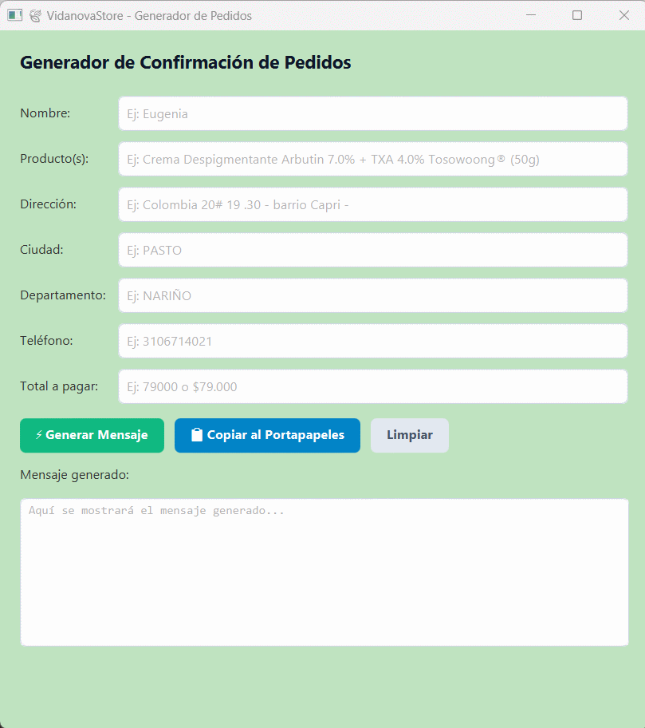
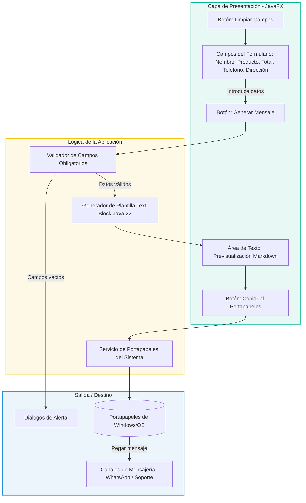

# 📖 GUÍA RÁPIDA DEL PROYECTO: VIDANOVA STORE - ORDER GENERATOR 🍃
Este proyecto es una **Aplicación de Escritorio Moderna** desarrollada en **Java 22** con **JavaFX 22** y empaquetada
con **Maven**, diseñada como una herramienta operativa de alta productividad para la generación instantánea de plantillas
de confirmación de pedidos en formato **Markdown con Emojis** para la tienda de comercio electrónico **VidanovaStore**.

La solución implementa una interfaz gráfica moderna estilizada mediante **CSS modular**, una arquitectura desacoplada y ligera
orientada a rendimiento inmediato (cero sobrecarga de frameworks pesados), integración nativa con el **Portapapeles del Sistema**,
validaciones de campos y empaquetado autónomo en **Fat JAR ejecutable** mediante el plugin Maven Shade.

**_Autor: Saul Echeverri Duque_**   
_Edición: 2026_




## Comenzando 🚀
El propósito de esta aplicación es resolver de manera eficiente la captura y estandarización de los mensajes de confirmación
que se envían a los clientes vía mensajería (WhatsApp, Telegram o canales de soporte), aplicando:
* **Java 22 Modern Features:** Empleo de *Text Blocks* multilínea con interpolación limpia de cadenas (`formatted`), tipado inferido y código limpio.
* **JavaFX 22 UI & UX:** Diseño centrado en el usuario con formularios estructurados (`GridPane`), alertas contextuales y responsividad en tiempo real.
* **Estilizado CSS Modular (UI Branding):** Identidad corporativa moderna basada en colores pastel (`#80d39b`, verde esmeralda y tonos slate) con esquinas redondeadas y estados visuales *hover/focus*.
* **Empaquetado Autónomo (Fat JAR):** Configuración de construcción para distribución sin dependencias externas mediante `Launcher` puente y Maven Shade.
---
## 1. REQUISITOS DEL SISTEMA ⚙️
Para compilar y ejecutar este proyecto en tu entorno local, necesitas contar con las siguientes herramientas:

### Requisitos Previos 🔧
* **Java Development Kit (JDK):** Versión 22 o superior (Amazon Corretto, Eclipse Temurin u Oracle OpenJDK).
* **Apache Maven:** Versión 3.9+ para la gestión del ciclo de vida y empaquetado del proyecto.
* **Sistema Operativo:** Windows 10/11, macOS o distribuciones Linux compatibles con JavaFX.
* **Git:** Para clonación y control de versiones.

Verifica tu versión de Java y Docker:
```shell
java -version
mvn -version
```
#### Clonar el Repositorio
Para comenzar, clona este repositorio en tu máquina local usando Git:

```shell
git clone https://github.com/saulolo/order-generator.git
cd order-generator
```

## Despliegue y Ejecución📦
En esta sección se detallan las opciones disponibles para compilar, ejecutar en desarrollo o empaquetar la aplicación para distribución final.


### Despliegue Local 🏠
**Opción A**: Ejecución Directa en Desarrollo (Consola / IDE)  
Puedes ejecutar la aplicación directamente sin compilar el JAR final:

```shell
# Ejecutar mediante el plugin de compilador de Maven
mvn compile exec:java -Dexec.mainClass="com.vidanova.Launcher"
```
O bien, desde **IntelliJ IDEA**:  
Abre el archivo src/main/java/com/vidanova/Launcher.java.
Haz clic en el ícono ▶️ verde y selecciona Run 'Launcher.main()'.

**Opción B**: Compilación y Generación del Ejecutable Autónomo (Fat JAR)
Para generar el archivo ejecutable listo para compartir y abrir con doble clic:

#### 1. Limpiar y empaquetar el proyecto
```shell
mvn clean package
```
#### 3.  Localizar y ejecutar el binario
Al finalizar el proceso con BUILD SUCCESS, se generará en la carpeta /target:  
- `order-generator-1.0.0.jar` (JAR ejecutable autónomo con todas las librerías incluidas).  
Puedes ejecutarlo desde terminal o simplemente hacer doble clic sobre el archivo .jar:

```shell
java -jar target/order-generator-1.0.0.jar
```

---
## 2. ESTRUCTURA DEL PROYECTO 🏗️
El proyecto sigue una estructura limpia, desacoplada y minimalista bajo las mejores prácticas de proyectos Maven estándar:


```ja
order-generator/
├── src/
│   └── main/
│       ├── java/
│       │   └── com/vidanova/
│       │       ├── Launcher.java       
│       │       └── MainApp.java        
│       └── resources/              
│           └── style.css               
├── target/                             
├── .gitignore                          
├── pom.xml                             
└── README.md                           
```

- `Launcher.java/`: Clase puente con método main estático. Evita el conflicto clásico de carga de módulos (unnamed module) al ejecutar Fat JARs en Java moderno.
- `MainApp.java/`: Clase principal que extiende de Application. Construye el formulario, valida que no existan campos vacíos, genera el formato Markdown y maneja la interacción con el portapapeles del sistema.
- `style.css/`: Personalización estética de componentes JavaFX (.text-field, .button, .text-area, .root) utilizando colores acordes a la identidad de la tienda.
- `pom.xml/`: Orquestador de construcción donde se especifican el compilador Java 22, las dependencias de JavaFX Controls y el plugin Shade.

---

## 3. ESPECIFICACIONES TÉCNICAS Y REQUERIMIENTOS 📋

El proyecto fue desarrollado siguiendo los siguientes requerimientos técnicos:

* **Plataforma base:** **Java 22** + **JavaFX 22.0.2**. ✅
* **Gestor de dependencias:** **Apache Maven**. ✅
* **Arquitectura de UI:** Formulario estructurado con componentes nativos `GridPane`, `VBox` y `HBox`. ✅
* **Gestión de portapapeles:** Integración con `Clipboard` y `ClipboardContent` para copia inmediata. ✅
* **Plantilla Markdown:** Interpolación mediante *Text Blocks* multilínea preservando emojis nativos. ✅
* **Validación de entradas:** Verificación proactiva de campos en blanco (isBlank()) con diálogos de alerta contextuales (Alert.AlertType.WARNING). ✅
* **Diseño visual (UI Branding):** Fondo verde pastel (`#80d39b`), bordes redondeados y tipografía moderna `Segoe UI`. ✅
* **Distribución portátil:** Generación de *Fat JAR* ejecutable con un solo clic. ✅

---

### 4. FLUJO FUNCIONAMIENTO DE LA APLICACIÓN 📊


### Formato del Mensaje Markdown Generado
```markdown
¡Hola Eugenia! 🌟

Acabamos de recibir tu compra del producto -- Crema Despigmentante Arbutin 7.0% + TXA 4.0% Tosowoong® (50g) en nuestra tienda 🍃VidanovaStore

El cual será entregado en:

*Dirección:* Colombia 20# 19 .30 - barrio Capri -
*Ciudad:* PASTO
*Departamento:* NARIÑO
*Teléfono:* 310 6714021
*Total a Pagar:* $89.900

El *envío* es totalmente *Gratis* y el pago es *Contra Entrega* para tu seguridad 🛍️🤍
🚚 Por favor *confírmanos* si tus datos son correctos para despachar tu pedido *ahora* 🤍
```

### Flujo del Proceso de la Aplicación
1. **Inicio e Inicialización (Bootstrap):** El usuario ejecuta el programa (`order-generator-1.0.0.jar`) haciendo doble clic o por terminal. La clase desacoplada `Launcher` arranca el ciclo de vida de JavaFX invocando `MainApp`, cargando la hoja de estilos (`style.css`) y desplegando la ventana principal (`Stage`).
2. **Entrada de Datos en el Formulario:** El operador o usuario introduce la información requerida del pedido en los 5 campos de texto (`TextField`) del formulario interactivo: Nombre completo, Producto(s), Total a pagar, Teléfono y Dirección de entrega.
3. **Disparo del Evento de Generación:** El usuario presiona el botón **"⚡ Generar Mensaje"**, activando el manejador de eventos `setOnAction` configurado en el controlador de la interfaz.
4. **Validación de Entradas (Fail-Fast):** Antes de procesar el mensaje, el sistema evalúa mediante la condición `isBlank()` si alguno de los campos obligatorios se encuentra vacío o solo con espacios en blanco. Si la validación falla, se detiene el flujo inmediatamente y se dispara un cuadro de diálogo modal de advertencia (`Alert.AlertType.WARNING`).
5. **Construcción y Formateo en Markdown:** Si todos los campos son válidos, los valores son limpiados de espacios sobrantes (`trim()`) e inyectados dentro de una plantilla de texto multilínea inmutable (*Text Block* de Java moderno con `.formatted(...)`), preservando saltos de línea y emojis nativos intactos.
6. **Previsualización en Pantalla:** El mensaje formateado resultante se asigna dinámicamente al componente `TextArea` (`txtResultado.setText(...)`), permitiendo al usuario revisar visualmente el texto antes de enviarlo.
7. **Copia al Portapapeles del Sistema Operativo:** Al presionar **"📋 Copiar al Portapapeles"**, el contenido se transfiere al portapapeles nativo del sistema operativo mediante los servicios `Clipboard` y `ClipboardContent` de JavaFX, y se muestra un diálogo de confirmación (`Alert.AlertType.INFORMATION`).
8. **Distribución al Canal de Mensajería:** El usuario simplemente presiona `Ctrl + V` en el chat del cliente (WhatsApp Web, Telegram o correo electrónico) para pegar el mensaje estructurado de confirmación sin errores manuales de digitación.

### Resumen del Flujo del Proceso:
`Usuario (Formulario UI)` ➡️ `Evento Botón Generar` ➡️ `Validador (isBlank)` ➡️ `Plantilla Text Block (Markdown)` ➡️ `TextArea (Previsualización)` ➡️ `Clipboard (Portapapeles OS)` ➡️ `Pegar en WhatsApp / Mensajería`

---

## 5. CAMPOS DEL FORMULARIO 📝

| Campo | Componente UI | Ejemplo de Entrada | Regla de Validación | Descripción |
| :--- | :--- | :--- | :--- | :--- |
| **Nombre** | `TextField` | `Eugenia` | Solo letras y espacios (admite tildes y ñ) | Nombre del cliente que realizó la compra |
| **Producto(s)** | `TextField` | `Crema Despigmentante Arbutin 7.0% + TXA 4.0% Tosowoong® (50g)` | Texto libre (no vacío) | Nombre detallado del artículo o combo solicitado |
| **Dirección** | `TextField` | `Colombia 20# 19 .30 - barrio Capri -` | Alfanumérico y símbolos usuales | Dirección de residencia o entrega del destinatario |
| **Ciudad** | `TextField` | `PASTO` | Solo letras y espacios | Municipio o ciudad de destino (se auto-formatea en mayúsculas) |
| **Departamento** | `TextField` | `NARIÑO` | Solo letras y espacios | Departamento de entrega (se auto-formatea en mayúsculas) |
| **Teléfono** | `TextField` | `3106714021` | Solo dígitos numéricos (`^[0-9]+$`) | Número de contacto telefónico para la guía logística |
| **Total a pagar** | `TextField` | `89900` o `$89.900` | Valor numérico positivo | Total a cobrar; se formatea automáticamente con separador de miles (`$89.900`) |

---

## Autor ✒️
¡Hola! Soy **Saul Echeverri Duque** 👨‍💻 , el creador y desarrollador de este proyecto. Permíteme compartir un poco sobre mi
formación y experiencia:

### Formación Académica 📚
- 📖 Titulado en Tecnología en Análisis y Desarrollo de Software por el SENA.
- 🎓 Graduado en Ingeniería de Alimentos por la Universidad de Antioquia, Colombia.
- 👨‍💻 Más de 4 años de experiencia en desarrollo de microservicios con Java, Spring Boot y Angular.

### Trayectoria Profesional 💼
Desarrollador de Software con sólida experiencia en el ecosistema Java y desarrollo de soluciones enfocadas en productividad, 
escalabilidad y buenas prácticas de ingeniería de software:

A lo largo de mi carrera, he aportado valor técnico en diversas empresas del sector tecnológico y financiero:

* 🏢 **[IAS Software](https://www.ias.com.co/) | Desarrollador de Software Full Stack**
* 🏢 **[Cidenet](https://cidenet.net/) | Analista de Desarrollo** 
* 🏢 **Convertic | Analista de Desarrollo** 


### Pasión por la Programación 🚀
- 💻 Mi viaje en el mundo de la programación comenzó en el 2021, y desde entonces, he estado inmerso en el emocionante
  universo del desarrollo de software.
- 📚 Uno de mis mayores intereses y áreas de enfoque es **Java**, y este proyecto es el resultado de mi deseo de compartir
  conocimientos y experiencias relacionadas con este lenguaje.


## Propósito y Agradecimientos 🎁
Quiero expresar mi sincero agradecimiento a todas las personas y clientes que confían día a día en [VidanovaStore🍃](https://vidanovastore.com/)

Este proyecto nace de la convicción de que la tecnología y la ingeniería de software deben ser aliadas directas del 
emprendimiento, permitiendo transformar procesos operativos manuales en flujos de trabajo ágiles, libres de errores y 
altamente profesionales.

El desarrollo de esta herramienta representa no solo la optimización logística de mi tienda, sino también un espacio 
continuo de aprendizaje y aplicación práctica del ecosistema **Java moderno**, demostrando que soluciones simples y bien 
diseñadas generan un impacto real e inmediato en el día a día de un negocio.


## Créditos y Contacto 📜
Este proyecto fue desarrollado por [Saul Echeverri](https://github.com/saulolo).
y fue realizado con la finalidad de optimizar la logística de comunicación de [VidanovaStore.]([VidanovaStore🍃](https://vidanovastore.com/))

Agradezco sinceramente el tiempo dedicado a la revisión de este proyecto. Valoro profundamente cualquier feedback técnico 
sobre las decisiones de arquitectura, diseño reactivo y buenas prácticas aplicadas. Quedo a total disposición para 
profundizar en cualquier detalle de la implementación durante el espacio de sustentación técnica:
- GitHub: [https://github.com/saulolo](https://github.com/saulolo) 🌐
- Correo Electrónico: [saulolo@gmail.com](saulolo@gmail.com) 📧
- LinkedIn: [https://www.linkedin.com/in/saul-echeverri-duque/](https://www.linkedin.com/in/saul-echeverri-duque/) 💼

---
### METADATOS DEL DOCUMENTO 📄


| Campo                    | Detalles                                                                                                        |
|:-------------------------|:----------------------------------------------------------------------------------------------------------------|
| **Título**               | GUÍA RÁPIDA DEL PROYECTO: VIDANOVA STORE - ORDER GENERATOR                                                      |
| **Autor(es)**            | Saul Echeverri                                                                                                  |
| **Versión**              | 1.0.0                                                                                                           |
| **Fecha de Creación**    | 23 de Septiembre de 2026                                                                                        |
| **Última Actualización** | 23 de Septiembre de 2026                                                                                        |
| **Notas Adicionales**    | Aplicación de escritorio desarrollada en Java 22 y JavaFX para la estandarización de confirmaciones de pedidos. |

---

